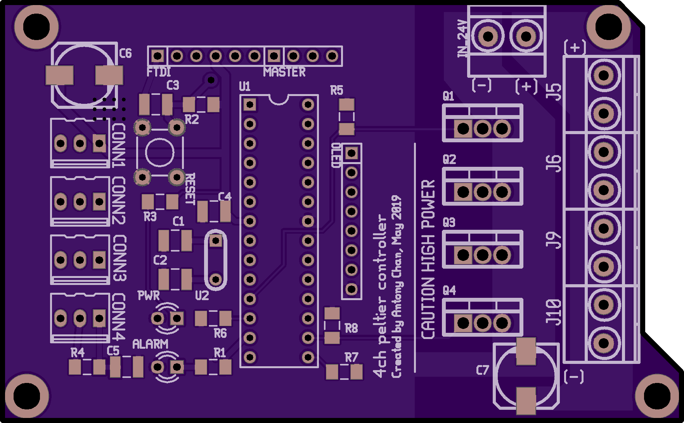

# 4-channel Peltier cooler, 30W

The custom PCB to control up to 4 individual Peliter coolers
interfacing the high power laser modules.

Technical specifications:

* Input: 24VDC, max 20A.

* Output per channel: up to 10A, PWM at 5% to 100% duty cycle.
  [30N06L](https://cdn.sparkfun.com/datasheets/Components/General/FQP30N06L.pdf)

* Recommended Peltier module: [series-parallel
  modules](https://tetech.com/wp-content/uploads/2013/11/SP-254-1.0-1.5.pdf)
  supporting up to 24VDC input, with up to 50W heat transfer on the cold side.

* Temperature sensor: Dallas digital temperature sensor with Onewire interface.
  [DS18B20](https://www.analog.com/media/en/technical-documentation/data-sheets/ds18b20.pdf)

* Microcontroller (MCU) power supply: 5VDC, max 200mA. Completely separated from
  the 12DVC supply.

* MCU programming interface: UART over TTL, via a 6-pin connecter with the [FTDI
  friend USB adapter](https://www.adafruit.com/product/284).

* External set point control: I2C bus to reduce the cabling effort.

## Why I made my own board

The board is primarily used to dissipate and stabilize the waste heat from the
[3,000mW laser modules](https://www.ushio.com/product/necsel-green-laser-53x/).
A large power is required to compensate the coupling loss of the homogenizing
liquid light quide and the TV lens, so that I can excite the fluorophores on all
96 wells on the multi-well plate (area: 180mm x 90mm).

At the time, there was an urgent need to create an evaluation board at less than
10% of the cost of the OEM laser parts. So, the OEM provided temperature
controller evaluation kits were a no go.

## Preview

## Schematics

## PCB routing

If I were to route the PCB again, I would have increased the pin-to-pin
separation of the TO-220 package to avoid short circuit. One way to solve this
is to draw a "tripod" footprint.

## Literatures

* The effect of pulse width modulation (PWM) frequency on the realiability of thermoelectric modules.
  https://tetech.com/wp-content/uploads/2013/10/ICT99MJN.pdf
